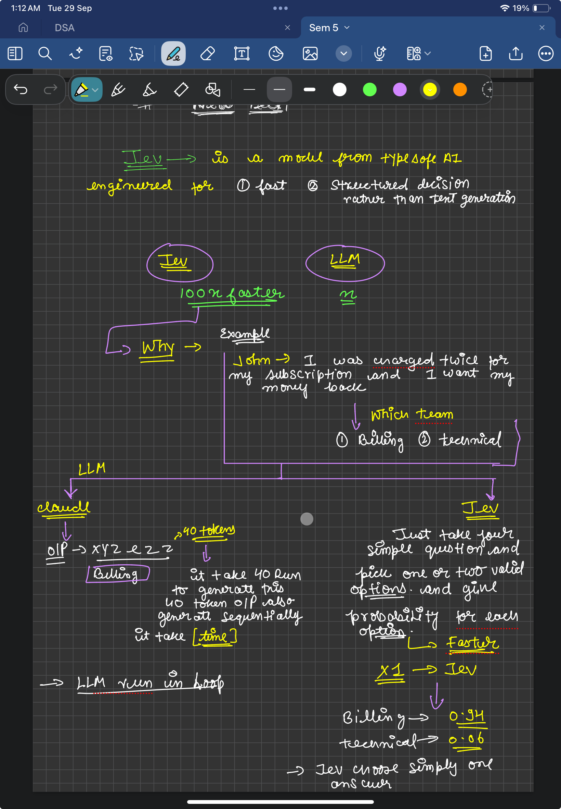

## What is Jev?

**Jev** is a model from TypeSafe AI (released mid-September 2026) engineered for fast, structured decisions rather than text generation. 

- **Single-pass execution:** Instead of generating tokens one at a time like an LLM, Jev executes in a single pass and returns a typed choice/score along with probabilities.
- **High-speed classification:** Dramatically faster and more cost-efficient for classification-style workflows (e.g., ticket routing, triage, intent classification).
- **Structured output:** Delivers direct typed decisions and confidence scores without requiring complex schema prompt-engineering or autoregressive decoding.

---

## Why is Jev ~100x Faster? (Jev vs. Traditional LLM)

## Key ideas
- LLMs generate answers token by token, so they are slower.
- Jev takes a question plus valid options and returns a probability for each
  option in one pass.
- Vendor-reported speedup: ~100x+ faster on decision tasks (unverified).

## Example: support ticket routing
Input: "I was charged twice for my subscription and I want my money back"
Options: Billing, Technical

Jev output:
- Billing: 0.94
- Technical: 0.06

The app picks the top option, or sends low-confidence cases to a human.

## Status
Learning log. More notes and small Jev projects to come.