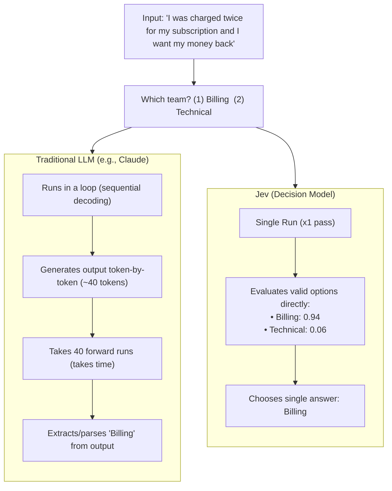

## What is Jev?

**Jev** is a model from TypeSafe AI (released mid-September 2026) engineered for:
1. **Fast execution**
2. **Structured decisions** (rather than text generation)

- **Single-pass execution:** Instead of generating tokens one at a time like an LLM, Jev executes in a single pass and returns a typed choice/score along with probabilities.
- **High-speed classification:** Dramatically faster and more cost-efficient for classification-style workflows (e.g., ticket routing, triage, intent classification).
- **Structured output:** Delivers direct typed decisions and confidence scores without requiring complex schema prompt-engineering or autoregressive decoding.

---

## Why is Jev ~100x Faster? (Jev vs. Traditional LLM)

### The Example

* **User Message:** *"I was charged twice for my subscription and I want my money back"*
* **Target Options:**
  1. `Billing`
  2. `Technical`

### How an LLM Handles It (e.g., Claude)
* **Runs in a loop:** LLMs generate text sequentially, token-by-token.
* **40 tokens = 40 runs:** Even generating a short response or JSON output (~40 tokens) takes 40 consecutive forward passes.
* **High latency:** Sequential generation accumulates time, adding overhead for simple classification decisions.

### How Jev Handles It
* **Direct probabilistic scoring:** Takes your simple question and valid options, calculating probabilities for each option directly.
* **Single execution (`x1 run`):** Evaluates everything in **1 pass** — no token-by-token loops.
* **Direct typed decision:**
  * `Billing` &rarr; **0.94**
  * `Technical` &rarr; **0.06**
* **Result:** Jev picks the correct answer directly and runs up to **100x faster**.
